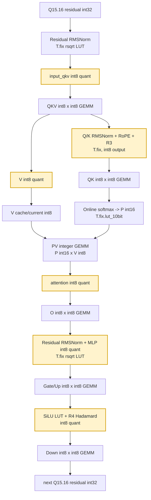
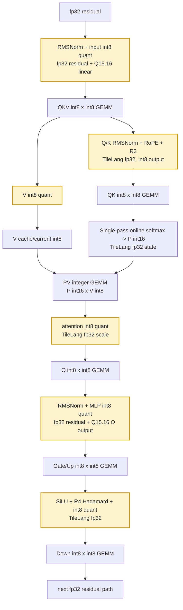

# Qwen3 Static Quantized Path

Run the standard 2048-token quality check:

```bash
# export MODEL_DIR=/publicdata/huggingface.co/Qwen/Qwen3-14B
# export BACKEND=hybrid
examples/qwen3_int_only/test_static_path.sh
```

The script defaults to Qwen3-0.6B and `BACKEND=int-only`; use `BACKEND=hybrid` for the hybrid path. Export `MODEL_DIR=/publicdata/huggingface.co/Qwen/Qwen3-14B` to run another Qwen3 model; the default pack path follows the model name under `/tmp`, and `PACKED_DIR=...` can override it. For large models, copy the HF model directory to `/tmp` or `/code` first and export that local path to avoid slow publicdata reads.

Default inputs:

```text
model:   /publicdata/huggingface.co/Qwen/Qwen3-0.6B
data:    /publicdata/huggingface.co/datasets/HuggingFaceFW/fineweb/sample/10BT/000_00000.parquet
```

## Qwen3-0.6B

2048-token FineWeb quality result against HF bf16:

| backend | tokens | loss | ppl | cos | mse |
| --- | ---: | ---: | ---: | ---: | ---: |
| HF bf16 | 2048 | 3.801437 | 44.765483 | - | - |
| fake-quant | 2048 | 3.819883 | 45.598856 | 0.99490349 | 1.16091984e-01 |
| hybrid | 2048 | 3.805733 | 44.958180 | 0.99515811 | 1.10790174e-01 |
| int-only | 2048 | 3.817301 | 45.481290 | 0.99059490 | 2.13982513e-01 |

Kernel profile for the int-only LLM block path: 2048 tokens, 28 layers, prefix KV cache enabled, 16 measured repeats.

| kernel | total ms | math TOPS | tc TOPS | tc util | pct |
| --- | ---: | ---: | ---: | ---: | ---: |
| attention_i8 | 278.512 | 55.54 | 83.31 | 13.35% | 36.49% |
| qk_norm_rope_i8 | 209.455 | - | - | - | 27.44% |
| linear_i8 | 188.653 | 152.99 | 152.99 | 24.52% | 24.72% |
| rms_sq8 | 36.423 | - | - | - | 4.77% |
| silu_hadamard_i8 | 35.078 | - | - | - | 4.60% |
| quant_v_i8 | 15.114 | - | - | - | 1.98% |
| total | 763.235 | 58.08 | 68.22 | 10.93% | 100.00% |

Kernel profile for the hybrid LLM block path: 2048 tokens, 28 layers, prefix KV cache enabled, 16 measured repeats.

| kernel | total ms | math TOPS | tc TOPS | tc util | pct |
| --- | ---: | ---: | ---: | ---: | ---: |
| attention_hybrid | 307.847 | 50.25 | 75.37 | 12.08% | 41.66% |
| linear_i8 | 190.497 | 151.51 | 151.51 | 24.28% | 25.78% |
| qk_norm_rope_quant_hybrid | 145.766 | - | - | - | 19.73% |
| silu_hadamard_quant_hybrid | 42.877 | - | - | - | 5.80% |
| rms_quant_hybrid | 35.123 | - | - | - | 4.75% |
| quant_v_i8 | 16.776 | - | - | - | 2.27% |
| total | 738.886 | 60.00 | 70.46 | 11.29% | 100.00% |

## Qwen3-14B

Previous 2048-token FineWeb quality result against HF bf16. Regenerate 14B with the FWHT R3 pack before comparing current 14B accuracy or performance.

| backend | tokens | loss | ppl | cos | mse |
| --- | ---: | ---: | ---: | ---: | ---: |
| HF bf16 | 2048 | 3.031365 | 20.725512 | - | - |
| fake-quant | 2048 | 3.048030 | 21.073791 | 0.98760375 | 4.06879236e-01 |
| hybrid | 2048 | 3.061501 | 21.359594 | 0.98554020 | 4.76366116e-01 |
| int-only | 2048 | 3.086833 | 21.907587 | 0.96654008 | 1.13380636e+00 |

Torch fake-quant uses the same packed int8 weights and static activation scales, but computes matmul, attention, and SiLU in torch float after QDQ. This gives the current pure-i8 quantization ceiling before kernel fixed-point error. The int-only kernel path should first close the gap from the current baseline to this fake-quant ceiling.

Kernel profile for the int-only LLM block path: 2048 tokens, 40 layers, prefix KV cache enabled, 16 measured repeats.

| kernel | total ms | math TOPS | tc TOPS | tc util | pct |
| --- | ---: | ---: | ---: | ---: | ---: |
| linear_i8 | 5686.283 | 152.27 | 152.27 | 24.40% | 75.88% |
| attention_i8 | 877.458 | 62.96 | 94.44 | 15.13% | 11.71% |
| qk_norm_rope_i8 | 557.940 | - | - | - | 7.45% |
| silu_hadamard_i8 | 208.252 | - | - | - | 2.78% |
| rms_sq8 | 140.128 | - | - | - | 1.87% |
| quant_v_i8 | 23.776 | - | - | - | 0.32% |
| total | 7493.836 | 122.92 | 126.60 | 20.29% | 100.00% |

Kernel profile for the hybrid LLM block path: 2048 tokens, 40 layers, prefix KV cache enabled, 16 measured repeats.

| kernel | total ms | math TOPS | tc TOPS | tc util | pct |
| --- | ---: | ---: | ---: | ---: | ---: |
| linear_i8 | 5681.917 | 152.39 | 152.39 | 24.42% | 75.60% |
| attention_hybrid | 954.760 | 57.86 | 86.79 | 13.91% | 12.70% |
| qk_norm_rope_quant_hybrid | 452.457 | - | - | - | 6.02% |
| silu_hadamard_quant_hybrid | 269.768 | - | - | - | 3.59% |
| rms_quant_hybrid | 133.932 | - | - | - | 1.78% |
| quant_v_i8 | 23.331 | - | - | - | 0.31% |
| total | 7516.164 | 122.55 | 126.23 | 20.23% | 100.00% |

On 0.6B, attention is a large share because the MLP/linear matrices are small. On 14B, the same 2048-token attention work is much less dominant relative to the hidden/intermediate-size linear work, so `linear_i8` becomes the main cost.

Utilization uses the A100 int8 tensorcore peak, 624 TOPS. `math TOPS` is the model matmul work, counted as `2MNK / time`. `tc TOPS` is the int8 tensorcore-equivalent work issued by the current kernels. Attention computes QK once with online softmax, then computes PV as `P int16 x V int8`; the current tensorcore lowering counts this PV as two int8-equivalent GEMMs.

The first run writes `qwen3_int_only.safetensors` and `timestamp`; later runs skip packing when the pack matches the current static schema. Use `FORCE_PACK=1 examples/qwen3_int_only/test_static_path.sh` to rebuild.

## Quantization Scheme

This example uses one static calibration pass to pack the model and then runs both `int-only` and `hybrid` inference from the same packed weights. Linear inputs are statically quantized to `int8`; all linear weights are per-channel static `int8`. All GEMMs in both backends are integer GEMMs. Hybrid only changes the non-GEMM scalar work: RMSNorm, RoPE, SiLU, Hadamard scaling, and online softmax are TileLang fp32 kernels, while QK, PV, QKV/O/Gate-Up/Down projections remain integer GEMMs.

The int-only backend stores the residual stream as Q15.16 `int32`. The hybrid backend stores the residual stream as `fp32`; each RMSNorm consumes `fp32 residual + Q15.16 linear output`, then emits `int8` activations for the next integer GEMM.

Calibration is data driven. The default script uses FineWeb from `/publicdata/huggingface.co/datasets`, 32 batches of 2048 tokens, and the same Chinese cache prompt used at evaluation time. QKV activation scales use the full calibrated sequence because prefix outliers matter for KV cache quality; non-QKV activation scales ignore the first 512 prefix tokens to avoid over-scaling MLP residual outliers that do not represent normal generated tokens.

QuaRot is applied during packing. R1 smooths residual-channel activation ranges through weight rotation, R2 rotates the V/O path, R3 is a fixed exact fast Hadamard on the Q/K head dimension, and R4 is the exact Hadamard rotation used before down_proj. R2 and R3 affect KV-cache semantics, so the cache builder applies the same R2 setting and the fixed R3 transform when it quantizes HF-generated prefix KV tensors.

Linear kernels consume `int8` activations and per-channel `int8` weights. Activation-scale x weight-scale factors are precomputed into packed XP5 quant parameters, so each linear kernel ends with one `T.fix.quant` from the `int32` accumulator back to Q15.16. The packed QKV and gate/up matrices are concatenated offline to avoid runtime packing kernels.

Attention is the main difference between the two backends. `int-only` keeps online softmax in fixed-point with `T.fix.lut_10bit`; `hybrid` keeps Q/K/V and all GEMMs integer but uses TileLang fp32 for online softmax and normalization work. Both backends compute QK once and compute PV as `P int16 x V int8`.

The hybrid backend is intended for hardware where tensorcore/NPU handles the GEMM-heavy work and a DSP can cheaply handle scalar fp32/fp16-style operations. Hybrid kernels do not use `T.fix`; int-only kernels keep the fixed-point path for the pure integer target.

Quality is reported against HF bf16 logits with PPL, cosine, MSE, MAE, max_abs, and rel_mse. `fake-quant` uses the same packed int8 weights and static activation scales but performs QDQ math in torch float, giving the current quantization ceiling before kernel arithmetic error.

## Runtime Flow

Int-only keeps the whole block in fixed-point integer form. The block order is RMSNorm, attention, RMSNorm, MLP. Every matrix multiply is an integer GEMM, including QK and PV in attention.



Hybrid uses the same integer GEMM dataflow but moves scalar-heavy work to TileLang fp32 kernels. The block order is RMSNorm, attention, RMSNorm, MLP. QK and PV are still integer GEMMs; fp32 is used only around them for residual accumulation, normalization, RoPE, SiLU, and online softmax state.



The int-only showcase implementation is in `model_int_only.py` and `kernels_int_only.py`; the hybrid implementation is in `model_hybrid.py` and `kernels_hybrid.py`. Packing, QuaRot, PPL, and profiling live under `utils/`.

Kernel numpy prototypes live under `utils/proto/` and can be checked with `python -m examples.qwen3_int_only.utils.proto.run_all`.
