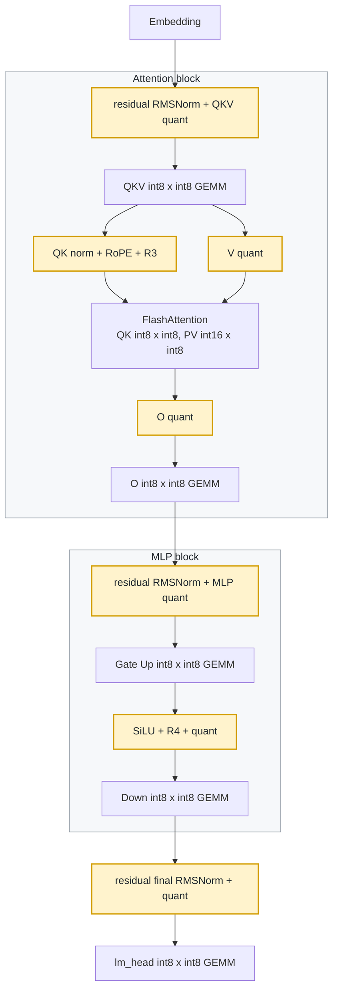

# Qwen3 Static Quantized Path

Run the standard 2048-token quality check:

```bash
# export MODEL_DIR=/publicdata/huggingface.co/Qwen/Qwen3-14B
examples/qwen3_int_only/test_static_path.sh
```

The script defaults to Qwen3-0.6B and `BACKEND=all`, which reports HF bf16, fake-quant, hybrid, and int-only quality. Export `MODEL_DIR=/publicdata/huggingface.co/Qwen/Qwen3-14B` to run another Qwen3 model; the default pack path follows the model name under `/tmp`, and `PACKED_DIR=...` can override it. For large models, copy the HF model directory to `/tmp` or `/code` first and export that local path to avoid slow publicdata reads.

Default inputs:

```text
model:   /publicdata/huggingface.co/Qwen/Qwen3-0.6B
data:    /publicdata/huggingface.co/datasets/HuggingFaceFW/fineweb/sample/10BT/000_00000.parquet
```

## Quantization Scheme

This example uses one static calibration pass to pack the model and then runs both `hybrid` and `int-only` inference from the same packed weights. Linear inputs are statically quantized to `int8`; all linear weights are per-channel static `int8`. Embedding and lm_head are also packed as `int8`. All GEMMs in both backends are integer GEMMs. Hybrid only changes the non-GEMM scalar work: RMSNorm, RoPE, SiLU, Hadamard scaling, and online softmax are TileLang fp32 kernels, while QK, PV, QKV/O/Gate-Up/Down/lm_head projections remain integer GEMMs.

The hybrid backend stores the residual stream as `fp32`; each RMSNorm consumes `fp32 residual + Q15.16 linear output`, then emits `int8` activations for the next integer GEMM. The int-only backend stores the residual stream as Q15.16 `int32` and keeps the whole block in fixed-point integer form.

Calibration is data driven. The default script uses FineWeb from `/publicdata/huggingface.co/datasets`, 32 batches of 2048 tokens, and the same Chinese cache prompt used at evaluation time. QKV activation scales use the full calibrated sequence because prefix outliers matter for KV cache quality; non-QKV activation scales ignore the first 512 prefix tokens to avoid over-scaling MLP residual outliers that do not represent normal generated tokens.

QuaRot is applied during packing. R1 smooths residual-channel activation ranges through a single model-wide weight rotation, R2 rotates the V/O path with one saved matrix per layer, R3 is a fixed exact fast Hadamard on the Q/K head dimension, and R4 is the exact Hadamard rotation used before down_proj. The pack saves `quarot.r1`, `quarot.r4`, and `layers.N.r2`; cache builders read those matrices from the pack instead of reconstructing them from random seeds. R2 and R3 affect KV-cache semantics, so the cache builder applies the saved R2 matrix and the fixed R3 transform when it quantizes HF-generated prefix KV tensors.

Linear kernels consume `int8` activations and per-channel `int8` weights. Activation-scale x weight-scale factors are precomputed into packed XP5 quant parameters, so each linear kernel ends with one `T.fix.quant` from the `int32` accumulator back to Q15.16. The packed QKV and gate/up matrices are concatenated offline to avoid runtime packing kernels. The input embedding lookup is outside the transformer block: `hybrid` reads the packed int8 embedding into an fp32 residual stream, while `int-only` reads it into Q15.16. The final RMSNorm emits `final_i8`, and lm_head is an `int8 x int8` GEMM.

Attention is the main difference between the two backends. `hybrid` keeps Q/K/V and all GEMMs integer but uses TileLang fp32 for online softmax and normalization work. `int-only` keeps online softmax in fixed-point with `T.fix.lut_10bit`. Both backends compute QK once and compute PV as `P int16 x V int8`.

The hybrid backend is intended for hardware where tensorcore/NPU handles the GEMM-heavy work and a DSP can cheaply handle scalar fp32/fp16-style operations. Hybrid kernels do not use `T.fix`; int-only kernels keep the fixed-point path for the pure integer target.

Quality is reported against HF bf16 logits with PPL, cosine, MSE. `fake-quant` uses the same packed int8 weights and static activation scales but performs QDQ math in torch float, giving the current quantization ceiling before kernel arithmetic error.

## Runtime Flow

Hybrid and int-only use the same graph below. The only semantic difference is the scalar/residual representation: hybrid uses fp32 residuals and fp32 scalar kernels, while int-only uses Q15.16 int32 residuals and fixed-point scalar kernels. All GEMMs are integer GEMMs in both paths.



The hybrid implementation is in `model_hybrid.py` and `kernels_hybrid.py`; the int-only showcase implementation is in `model_int_only.py` and `kernels_int_only.py`. Packing, QuaRot, PPL, and profiling live under `utils/`.

Kernel numpy prototypes live under `utils/proto/` and can be checked with `python -m examples.qwen3_int_only.utils.proto.run_all`.

## Qwen3-0.6B

2048-token FineWeb quality result against HF bf16:

| backend | tokens | loss | ppl | cos | mse |
| --- | ---: | ---: | ---: | ---: | ---: |
| HF bf16 | 2048 | 3.801437 | 44.765483 | - | - |
| fake-quant | 2048 | 3.827024 | 45.925637 | 0.99504178 | 1.16263217e-01 |
| hybrid | 2048 | 3.815134 | 45.382829 | 0.99455598 | 1.26209386e-01 |
| int-only | 2048 | 3.833913 | 46.243149 | 0.98968546 | 2.35026454e-01 |

Kernel profile for the hybrid embedding + transformer block path: 2048 tokens, 28 layers, prefix KV cache enabled, 16 serial measured repeats. The final RMSNorm and lm_head are included in the quality path above, but not in this kernel profile table.

| kernel | total ms | math TOPS | tc TOPS | tc util | pct |
| --- | ---: | ---: | ---: | ---: | ---: |
| attention_hybrid | 284.948 | 54.28 | 81.43 | 13.05% | 51.24% |
| linear_i8 | 142.863 | 202.03 | 202.03 | 32.38% | 25.69% |
| qk_norm_rope_quant_hybrid | 42.131 | - | - | - | 7.58% |
| rms_quant_hybrid | 34.600 | - | - | - | 6.22% |
| silu_hadamard_quant_hybrid | 34.434 | - | - | - | 6.19% |
| quant_v_i8 | 16.200 | - | - | - | 2.91% |
| embed_f32 | 0.949 | - | - | - | 0.17% |
| total | 556.125 | 79.71 | 93.62 | 15.00% | 100.00% |

Kernel profile for the int-only embedding + transformer block path: 2048 tokens, 28 layers, prefix KV cache enabled, 16 serial measured repeats. The final RMSNorm and lm_head are included in the quality path above, but not in this kernel profile table.

| kernel | total ms | math TOPS | tc TOPS | tc util | pct |
| --- | ---: | ---: | ---: | ---: | ---: |
| attention_i8 | 254.342 | 60.82 | 91.23 | 14.62% | 49.00% |
| linear_i8 | 140.983 | 204.72 | 204.72 | 32.81% | 27.16% |
| qk_norm_rope_i8 | 44.505 | - | - | - | 8.57% |
| rms_residual | 32.472 | - | - | - | 6.26% |
| silu_hadamard_i8 | 30.609 | - | - | - | 5.90% |
| quant_v_i8 | 15.196 | - | - | - | 2.93% |
| embed_q15 | 0.963 | - | - | - | 0.19% |
| total | 519.069 | 85.40 | 100.30 | 16.07% | 100.00% |

## Qwen3-14B

2048-token FineWeb quality result against HF bf16:

| backend | tokens | loss | ppl | cos | mse |
| --- | ---: | ---: | ---: | ---: | ---: |
| HF bf16 | 2048 | 3.031365 | 20.725512 | - | - |
| fake-quant | 2048 | 3.064358 | 21.420716 | 0.98755582 | 4.08353757e-01 |
| hybrid | 2048 | 3.066517 | 21.467000 | 0.98510624 | 4.89788597e-01 |
| int-only | 2048 | 3.088784 | 21.950364 | 0.96796236 | 1.09022166e+00 |

Kernel profile for the hybrid embedding + transformer block path: 2048 tokens, 40 layers, prefix KV cache enabled, 16 serial measured repeats. The final RMSNorm and lm_head are included in the quality path above, but not in this kernel profile table.

| kernel | total ms | math TOPS | tc TOPS | tc util | pct |
| --- | ---: | ---: | ---: | ---: | ---: |
| linear_i8 | 2078.598 | 416.56 | 416.56 | 66.76% | 60.50% |
| attention_hybrid | 948.454 | 58.25 | 87.37 | 14.00% | 27.61% |
| silu_hadamard_quant_hybrid | 170.987 | - | - | - | 4.98% |
| rms_quant_hybrid | 133.578 | - | - | - | 3.89% |
| qk_norm_rope_quant_hybrid | 80.361 | - | - | - | 2.34% |
| quant_v_i8 | 22.166 | - | - | - | 0.65% |
| embed_f32 | 1.466 | - | - | - | 0.04% |
| total | 3435.609 | 268.11 | 276.15 | 44.25% | 100.00% |

Kernel profile for the int-only embedding + transformer block path: 2048 tokens, 40 layers, prefix KV cache enabled, 16 serial measured repeats. The final RMSNorm and lm_head are included in the quality path above, but not in this kernel profile table.

| kernel | total ms | math TOPS | tc TOPS | tc util | pct |
| --- | ---: | ---: | ---: | ---: | ---: |
| linear_i8 | 2081.500 | 415.98 | 415.98 | 66.66% | 63.97% |
| attention_i8 | 769.615 | 71.78 | 107.67 | 17.26% | 23.65% |
| silu_hadamard_i8 | 152.530 | - | - | - | 4.69% |
| rms_residual | 135.905 | - | - | - | 4.18% |
| qk_norm_rope_i8 | 91.135 | - | - | - | 2.80% |
| quant_v_i8 | 21.639 | - | - | - | 0.67% |
| embed_q15 | 1.465 | - | - | - | 0.05% |
| total | 3253.789 | 283.09 | 291.58 | 46.73% | 100.00% |

On 0.6B, attention is a large share because the MLP/linear matrices are small. On 14B, the same 2048-token attention work is much less dominant relative to the hidden/intermediate-size linear work, so `linear_i8` becomes the main cost.

Utilization uses the A100 int8 tensorcore peak, 624 TOPS. `math TOPS` is the model matmul work, counted as `2MNK / time`. `tc TOPS` is the int8 tensorcore-equivalent work issued by the current kernels. Attention computes QK once with online softmax, then computes PV as `P int16 x V int8`; the current tensorcore lowering counts this PV as two int8-equivalent GEMMs.

The first run writes `qwen3_int_only.safetensors` and `timestamp`; later script runs reuse the pack when `timestamp` exists and print that timestamp. Kernel profiling also caches the quantized prefix KV tensors under the packed directory, so repeated 14B profile runs do not need to reload the HF model just to rebuild the same prefix cache. Use `FORCE_PACK=1 examples/qwen3_int_only/test_static_path.sh` to rebuild.
